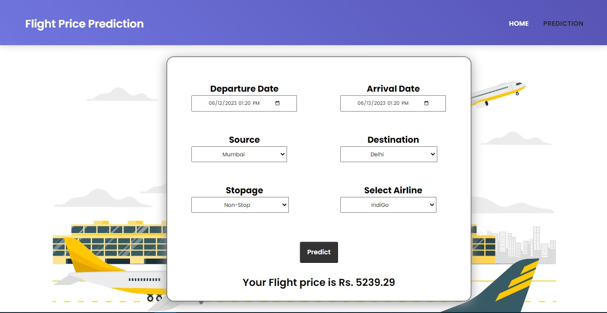

# Flight-Fare-Prediction
   

>A flight price prediction application is developed to estimate airfare for a specific date based on various factors such as source, destination, number of stops, and airline. This project utilizes a Kaggle dataset, which undergoes data cleaning, wrangling, and exploratory data analysis to derive valuable insights. Machine learning techniques are then applied to train the model for price prediction. The problem is approached as a regression task, with the RandomForestRegressor algorithm providing accurate fare estimates. A Flask-based web application enables users to interact with the system and obtain precise flight fare predictions.

## Features:

-Departure and arrival dates.
-Source (Four destinations selected for this project).
-Destination (Four destinations selected for this project).
-Total number of stops.
-Selected airlines
-Price (Target variable)

## Models with their Accuracy of Prediction

| Type of Model            | Accuracy |
| ------------------------ | -------- |
| Linear Regression        | 72.00%   |
| XGBoost                  | 82.00%   |
| ExtraTreeReressor        | 93.70%   |
| Random Forest            | 93.70%   |


## NOTE

> You can access the website live at: https://flight-fare-prediction-i1mr.onrender.com/ <br>

## Steps to run this application in your system

1. Clone or download the repo.
 
2. Open the command prompt in the downloaded folder.

3. Install all the dependencies:

```
pip install -r requirements.txt
```

4. Run the application

```
python app.py
```

## Technologies Used:

     

## Sample images of the web application

### Prediction Page

<br>

### Predictions
In the Below predictions we have selected the source as Mumbai & the destination as Delhi, the flight would be non-stop & the airline we have selected is IndiGo and the price we got is around Rs 5239 
<br>


<br>

# Air-fare-prediction-system
